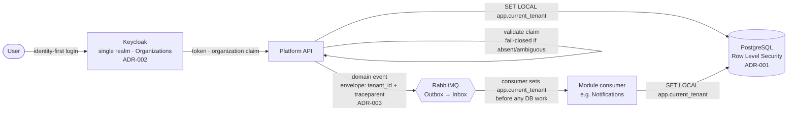

# TerminWise

> **Multi-tenant, event-driven SaaS reference architecture** — a .NET modular monolith that
> evolves into microservices by extraction. Clean Architecture, custom CQRS, Keycloak,
> RabbitMQ + Outbox, Angular 22 Signal Forms, and an AI booking assistant.
>
> The domain (appointment/reservation management for small businesses — barbershops,
> physiotherapists, studios) is intentionally simple. **The architecture is the star.**
>
> _"Termin" is German for appointment — the target market is Germany._

<!-- Phase 0: vision + architecture-at-a-glance skeleton. The "Architecture at a glance"
     section is finalized in Slice 5 once ADR-001..004 are Accepted. -->

## Why this repo exists

- Demonstrate **senior/architect-level decision making** — every significant choice is an
  [Architecture Decision Record](./docs/adr/README.md).
- Each phase ends in a **demonstrable, working state**: `main` is always green, README always current.
- Produce reusable content for planned deep-dive articles (Keycloak, SSE vs. WebSocket, OpenTelemetry).

## Architecture at a glance

The system starts as a **modular monolith** whose module boundaries are designed as
**future service boundaries**: modules own their DB schema, expose only public contracts and
events, never reference another module's internals, and share no database transaction —
consistency between modules is eventual, via the outbox ([ADR-004](./docs/adr/0004-custom-cqrs-modular-monolith.md)).
These rules are enforced by architecture tests. Phase 6 extracts services along those seams.

### The tenant-context spine

The architectural backbone is a single tenant-identity path that runs from login all the way
to the database row, and continues across async message boundaries. Identity decides the
tenant; the database *enforces* it.



**Read the spine as:** `login → organization claim → app.current_tenant → RLS`. The
`organization` claim ([ADR-002](./docs/adr/0002-keycloak-tenancy.md)) supplies the tenant id;
the API validates it and pushes it to the DB session as `app.current_tenant`; PostgreSQL
**Row Level Security** ([ADR-001](./docs/adr/0001-postgres-tenancy-model.md)) makes isolation
a database guarantee, not an application convention. The **same tenant context rides every
message** — the envelope carries `tenant_id` (consumers fail-closed without it) and W3C
`traceparent` ([ADR-003](./docs/adr/0003-message-broker-and-client.md)) — so isolation and
tracing hold across the async path too. Diagram source: [`docs/diagrams/tenant-context-spine.md`](./docs/diagrams/tenant-context-spine.md).

See all decisions in the [ADR index](./docs/adr/README.md).

## Tech stack

| Area | Choice |
|---|---|
| Backend | .NET 10 (LTS), Clean Architecture, custom CQRS (no MediatR — see ADR-004), DDD |
| Validation | FluentValidation as a pipeline behavior in the custom CQRS dispatcher |
| Frontend | Angular 22 (zoneless, OnPush), standalone components, Signal Forms |
| Frontend state | NgRx SignalStore (default); one module in classic NgRx as a documented comparison |
| UI / CSS | Tailwind CSS v4 + Angular Material |
| Identity | Keycloak (tenancy per ADR-002) |
| Data | PostgreSQL (EF Core + Npgsql) — tenancy per ADR-001 |
| Cache | Redis (cache-aside, tenant-prefixed keys) |
| Messaging | RabbitMQ + Outbox/Inbox (client per ADR-003) |
| Search | Elasticsearch (tenant isolation per ADR-007) |
| AI | Standalone service — Microsoft Agent Framework + Azure AI Foundry, tool calling, SSE |
| Background jobs | Custom `BackgroundService` (outbox) + Quartz.NET (scheduling) |
| Observability | OpenTelemetry (logs/metrics/traces) → Grafana stack locally |
| Testing | xUnit, ArchUnitNET, Testcontainers (backend); Vitest, Playwright (frontend) |
| IaC / Deploy | Terraform → Azure, GitHub Actions |

## Repository layout

```
src/            backend projects (Clean Architecture — populated in Phase 1)
tests/          backend tests (unit, architecture, integration)
frontend/       Angular 22 app (Phase 1)
docs/adr/       Architecture Decision Records (MADR)
docs/diagrams/  architecture diagrams
docker-compose.yml   local dev stack (grows phase by phase)
```

## Roadmap

Full plan in [`ROADMAP.md`](./ROADMAP.md). Progress:

| Phase | Focus | Status |
|---|---|---|
| 0 | Foundation + ADRs | ✅ done |
| 1 | Modular monolith MVP (Booking) | ⬜ |
| 2 | Multi-tenancy + Keycloak + Redis | ⬜ |
| 3 | RabbitMQ + Outbox/Inbox | ⬜ |
| 4 | Elasticsearch + OpenTelemetry | ⬜ |
| 4.5 | AI booking assistant | ⬜ |
| 5 | Terraform + Azure + content | ⬜ |
| 6 | Microservice extraction + YARP gateway | ⬜ |

## License

[MIT](./LICENSE)
