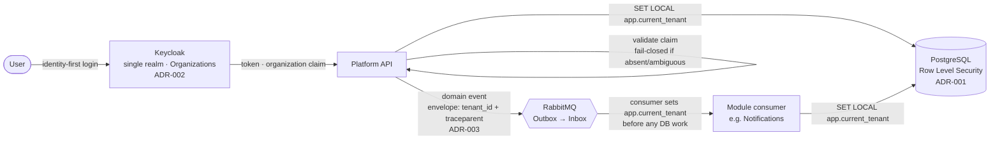

# Tenant-context spine

The architectural backbone of TerminWise: a single tenant-identity path from login to the
database row, preserved across async message boundaries. **Identity decides the tenant; the
database enforces it.**

`login → organization claim → app.current_tenant → RLS`

## The decisions this diagram composes

| Step | Decision | ADR |
|---|---|---|
| Tenant = Keycloak Organization; `organization` claim carries the tenant id; multi-org users resolved by scope selection; API rejects absent/ambiguous claims (fail-closed) | Keycloak tenancy | [ADR-002](../adr/0002-keycloak-tenancy.md) |
| Tenant id pushed to the DB session as `app.current_tenant` via `SET LOCAL` (transaction-scoped; pooling-safe); PostgreSQL RLS enforces isolation; app role is non-owner without `BYPASSRLS` | PostgreSQL tenancy | [ADR-001](../adr/0001-postgres-tenancy-model.md) |
| Every message envelope carries `tenant_id` (consumers fail-closed, set `app.current_tenant` before DB work) and W3C `traceparent` (one trace spans API → broker → consumer) | Broker & client | [ADR-003](../adr/0003-message-broker-and-client.md) |
| Modules share no DB transaction; cross-module consistency is eventual via the outbox — which is what makes the async hop above possible without distributed transactions | Custom CQRS + modular monolith | [ADR-004](../adr/0004-custom-cqrs-modular-monolith.md) |

> This is a Phase 0 conceptual diagram. It is refined into per-phase detail as the
> implementation lands (tenant resolution middleware in Phase 2, outbox/inbox in Phase 3,
> full OpenTelemetry tracing in Phase 4).
